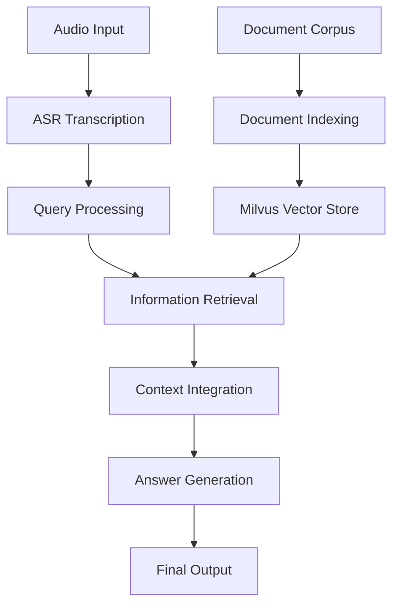

# RAG-ASR Integration Project

An advanced Retrieval Augmented Generation (RAG) system integrated with Automatic Speech Recognition (ASR), leveraging the power of OpenAI's Whisper model, LangChain, and Milvus vector database. This project supports real-time transcription, information retrieval, and question answering.

## 🌟 Features

- 🎙️ Real-time speech transcription using OpenAI's Whisper model
- 🧠 RAG-based information retrieval and question answering
- 🗄️ Efficient vector storage and search using Milvus
- 🔗 Integration with LangChain for advanced NLP tasks
- 🐳 Docker support for easy deployment of Milvus

## 📁 Project Structure

```
rag_asr_system/
├── docker/
│   └── docker-compose.yml
├── rag_asr_app.py
├── asr_interface.py
├── document_loader.py
├── vector_store.py
├── rag_chain.py
├── utils.py
├── requirements.txt
└── README.md
```

## 🛠️ Installation

1. Clone the repository:
   ```bash
   git clone https://github.com/yourusername/rag-asr-system.git
   cd rag-asr-system
   ```

2. Set up a virtual environment:
   ```bash
   python -m venv venv
   source venv/bin/activate  # On Windows, use `venv\Scripts\activate`
   ```

3. Install dependencies:
   ```bash
   pip install -r requirements.txt
   ```

4. Set up Milvus using Docker:
   ```bash
   cd docker
   docker-compose up -d
   ```

## 🚀 Usage

### Running the RAG-ASR System

1. Ensure Milvus is running:
   ```bash
   docker-compose ps
   ```

2. Set your OpenAI API key:
   ```bash
   export OPENAI_API_KEY=your_api_key_here
   ```

3. Run the main application:
   ```bash
   python rag_asr_app.py
   ```

4. When prompted, enter the path to your audio file for transcription and querying.

## 🔧 Customization

- 📊 Use different data sources by modifying the URL in `rag_asr_app.py`
- 🛠️ Adjust ASR model settings in `asr_interface.py`
- 🔬 Optimize vector search by modifying parameters in `vector_store.py`
- 📝 Customize RAG prompts and chain in `rag_chain.py`

## 🧪 Testing

Run tests with pytest:
```bash
pytest tests/
```

## 💻 Performance Optimization

To improve performance:

1. 📉 Adjust batch sizes for vector storage and retrieval
2. 🔽 Use a smaller Whisper model for faster ASR
3. 📈 Implement caching mechanisms for frequently accessed data
4. 🔀 Enable parallel processing for document loading and indexing

## 📊 System Workflow

The RAG-ASR system follows this high-level workflow:

1. **ASR Transcription**: Audio input is transcribed to text using Whisper.
2. **Document Indexing**: Relevant documents are loaded and indexed in Milvus.
3. **Query Processing**: The transcribed text is used as a query for the RAG system.
4. **Information Retrieval**: Relevant information is retrieved from Milvus.
5. **Answer Generation**: An LLM generates an answer based on the retrieved context.



## 📄 License

This project is licensed under the MIT License. See the [LICENSE](LICENSE) file for details.

## 🙏 Acknowledgments

- OpenAI for the Whisper model
- LangChain for the RAG framework
- Milvus for the vector database
- Hugging Face for the Transformers library